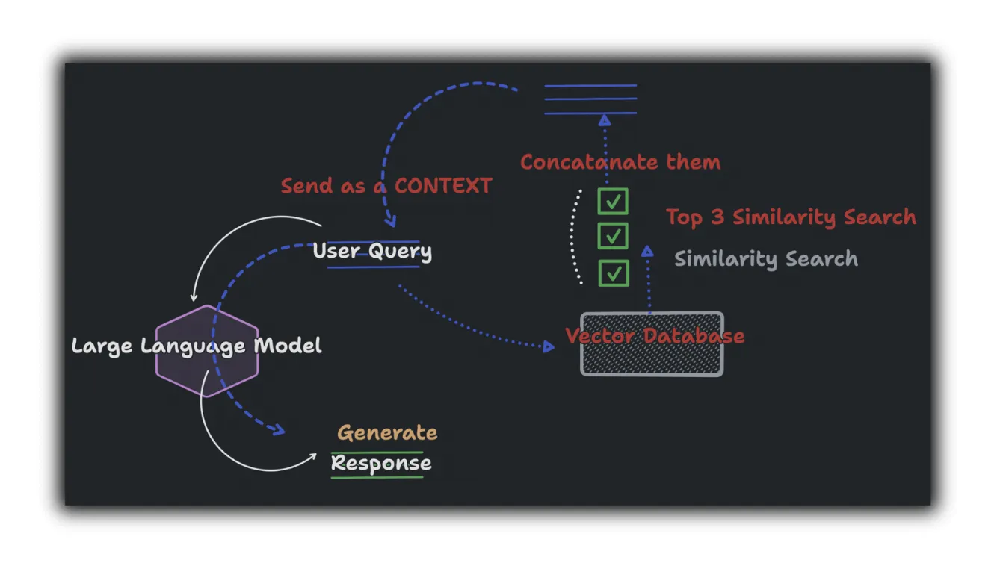

# 🤖 AI RAG Chatbot with Modern UI

A sophisticated **Retrieval Augmented Generation (RAG) chatbot** built with Streamlit, LangChain, and OpenAI GPT-4. Features a modern, intuitive interface for document-based conversations.



## ✨ Features

- **Modern UI Design**: Clean, centered interface with sparkle animations and suggestion cards
- **Multi-PDF Support**: Upload and chat with multiple PDF documents simultaneously
- **Smart Document Retrieval**: FAISS vector search for accurate context retrieval
- **Streaming Responses**: Real-time GPT-4 responses with typing indicators
- **Session Management**: Persistent conversation history within sessions
- **Responsive Design**: Works seamlessly across different screen sizes
- **Source Attribution**: Responses include page numbers and filenames for verification

## 🏗️ Architecture

### Core Components
- **`app.py`**: Streamlit frontend with modern UI and chat interface
- **`brain.py`**: RAG processing engine (PDF parsing, chunking, vector indexing)
- **`.env`**: Environment configuration (OpenAI API key)

### Technology Stack
- **Frontend**: Streamlit with custom CSS styling
- **Backend**: Python with LangChain framework
- **Vector Store**: FAISS (Facebook AI Similarity Search)
- **Embeddings**: OpenAI text-embedding models
- **LLM**: OpenAI GPT-4 with streaming
- **PDF Processing**: PyPDF for text extraction

## 🚀 Quick Start

### Prerequisites
- Python 3.8+
- OpenAI API key

### Installation

1. **Clone the repository**
   ```bash
   git clone https://github.com/krishn1122/AI-Chatbot-RAG.git
   cd AI-Chatbot-RAG
   ```

2. **Create virtual environment**
   ```bash
   python -m venv venv
   source venv/bin/activate  # On Windows: venv\Scripts\activate
   ```

3. **Install dependencies**
   ```bash
   pip install -r requirements.txt
   ```

4. **Set up environment variables**
   ```bash
   # Create .env file and add your OpenAI API key
   echo "OPENAI_API_KEY=your_api_key_here" > .env
   ```

5. **Run the application**
   ```bash
   streamlit run app.py
   ```

## 💡 How It Works

### RAG Pipeline
1. **Document Upload**: Users upload PDF files through the web interface
2. **Text Extraction**: PyPDF extracts and cleans text content
3. **Document Chunking**: Text is split into 4000-character chunks with metadata
4. **Vector Embedding**: OpenAI creates vector representations of text chunks
5. **Index Creation**: FAISS builds a searchable vector database
6. **Query Processing**: User questions trigger similarity search (top-3 results)
7. **Context Augmentation**: Retrieved chunks are added to the GPT-4 prompt
8. **Response Generation**: GPT-4 generates contextual responses with source attribution

### User Experience Flow
1. **Landing Page**: Modern interface with suggestion cards and PDF upload
2. **Document Processing**: Automatic vector database creation with progress indicators
3. **Interactive Chat**: Real-time conversations with document-aware responses
4. **Source Tracking**: All responses include page numbers and filenames

## 🎯 Usage Examples

### Example Queries
- "What are the main topics discussed in the uploaded documents?"
- "Summarize the key findings from page 5 of document.pdf"
- "Compare the methodologies mentioned across different documents"
- "What recommendations are provided in the conclusion?"

## 🔧 Configuration

### Environment Variables
Create a `.env` file in the root directory:
```env
OPENAI_API_KEY=your_openai_api_key_here
```

### Customization Options
- **Chunk Size**: Modify `chunk_size` in `brain.py` (default: 4000 characters)
- **Similarity Search**: Adjust `k` parameter in `app.py` (default: 3 results)
- **Model Selection**: Change GPT model in `app.py` (default: gpt-4)

## 📁 Project Structure

```
AI-Chatbot-RAG/
├── app.py              # Main Streamlit application
├── brain.py            # RAG processing logic
├── requirements.txt    # Python dependencies
├── .env               # Environment variables
├── .gitignore         # Git ignore rules
├── README.md          # Project documentation
├── thumbnail.webp     # Project thumbnail
└── venv/              # Virtual environment
```

## 🤝 Contributing

1. Fork the repository
2. Create a feature branch (`git checkout -b feature/amazing-feature`)
3. Commit your changes (`git commit -m 'Add amazing feature'`)
4. Push to the branch (`git push origin feature/amazing-feature`)
5. Open a Pull Request

## 📄 License

This project is licensed under the MIT License - see the [LICENSE](LICENSE) file for details.

## 🙏 Acknowledgments

- [LangChain](https://www.langchain.com) for the RAG framework
- [Streamlit](https://streamlit.io) for the web interface
- [OpenAI](https://openai.com) for GPT-4 and embeddings
- [FAISS](https://github.com/facebookresearch/faiss) for vector similarity search


